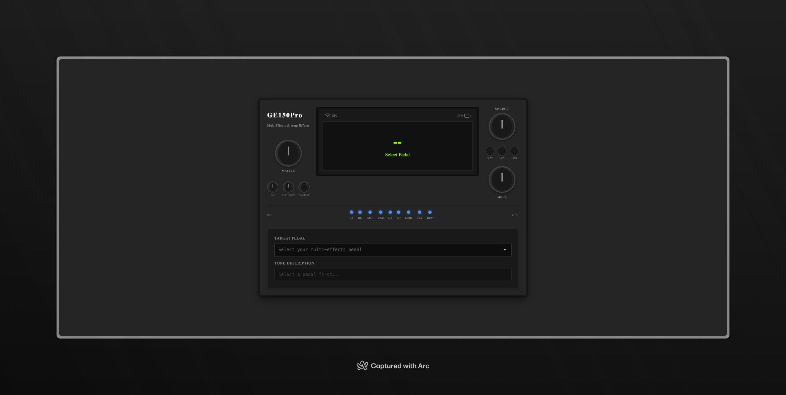
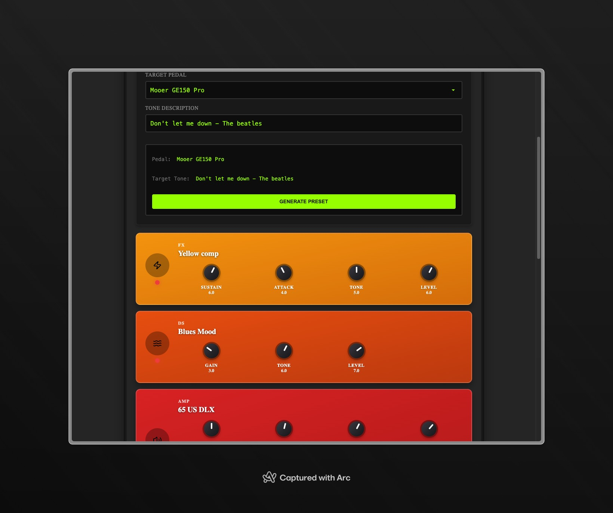

# Preset-X




## About Preset-X

Preset-X is a multi-effects pedal preset generator that leverages the power of AI to create precise, production-ready presets based on a desired guitar tone. It aims to simplify the process of dialing in specific sounds on multi-effects pedals, providing a starting point that can then be fine-tuned by the user.

## How it was Created

Preset-X was developed as a SvelteKit application, utilizing a Backend-for-Frontend (BFF) pattern to securely interact with the Gemini AI API. The core idea is to provide a user-friendly interface where guitarists can select their multi-effects pedal and describe their desired tone. The application then communicates with a server-side endpoint, which in turn constructs a detailed prompt for the Gemini AI.

The AI, acting as a "Senior Effects Pedal Programming Engineer," analyzes the request, considers the constraints of the selected pedal (available effects and modules), and generates a JSON object representing the effects chain preset. This JSON output is strictly validated against a predefined schema to ensure consistency and reliability. The frontend then renders this generated preset, allowing users to visualize and understand the suggested settings.

Key technologies and practices employed:

- **SvelteKit:** For a fast, modern, and reactive frontend experience, and for its server-side capabilities to implement the BFF pattern.
- **TypeScript:** To ensure type safety and improve code maintainability across the application.
- **Gemini AI API:** The core intelligence behind preset generation, configured with specific system instructions and a JSON response schema for controlled and accurate outputs.
- **Environment Variables:** For secure management of API keys and other sensitive configurations.
- **Robust Error Handling:** To gracefully manage potential issues during API calls or data processing.

## Why it was Created

The inspiration behind Preset-X stems from the often-complex and time-consuming process of creating custom presets on multi-effects pedals. Many guitarists, from beginners to seasoned professionals, spend countless hours tweaking parameters to achieve a specific sound. This application aims to:

- **Demystify Preset Creation:** Provide an intelligent assistant that can translate natural language tone descriptions into concrete pedal settings.
- **Accelerate Workflow:** Offer a quick starting point for new sounds, reducing the initial setup time and allowing more focus on playing and creativity.
- **Educational Tool:** Help users understand how different effects and their parameters contribute to a desired tone.
- **Showcase AI Capabilities:** Demonstrate the practical application of large language models in a niche, creative domain.

## Getting Started

To get Preset-X up and running on your local machine, follow these steps:

### Prerequisites

- Node.js (LTS version recommended)
- pnpm (or npm/yarn, but pnpm is used in this project)
- A Google Cloud Project with access to the Gemini API and a `GEMINI_API_KEY`.

### Installation

1.  **Clone the repository:**

    ```bash
    git clone https://github.com/olaracode/preset-x.git
    cd preset-x
    ```

2.  **Install dependencies:**

    ```bash
    pnpm install
    ```

3.  **Configure Environment Variables:**
    Create a `.env` file in the root of the project based on `.env.example` and add your Gemini API key:
    ```
    GEMINI_API_KEY="YOUR_GEMINI_API_KEY"
    ```

### Running the Application

1.  **Start the development server:**

    ```bash
    pnpm dev
    ```

2.  **Open in browser:**
    The application will typically be available at `http://localhost:5173` (or another port if 5173 is in use).

### Building for Production

To build the application for production, run:

```bash
pnpm build
```

This will create an optimized version of your application in the `build` directory.
